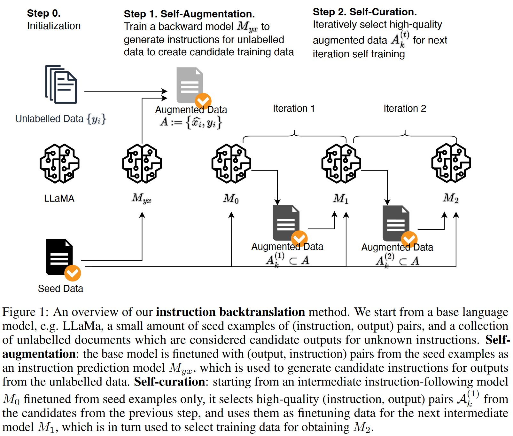

# 🐋 Humback

An **unofficial** implementation of [Self-Alignment with Instruction Backtranslation](https://arxiv.org/pdf/2308.06259.pdf) .

The proposed Humback is a novel framework that can augment the instruction data for supervised fine-tuning with high quality.

🚧 Currently, this repo is under construction and not finished.



## 🌴 Dependencies

- Python==3.11.4
- PyTorch==2.0.1
- Others: [requirements.txt](./requirements.txt)

## 🚀 QuickStart

Procedure (2 iters):
1. Prepare seed data and unlabelled data.
2. Train the backward model $M_{yx}$ on the reversed seed data.
3. Self-augment the seed data via $M_{yx}$.
4. Train a forward model $M_{0}$ on the seed data.
5. Self-curate the unlabelled data $A_{k}^{(1)}$ via $M_{0}$ (tag quality scores).
6. Train a forward model $M_{1}$ on the self-curated unlabelled data $A_{k}^{(1)}$.
7. Use $M_{1}$ to self-curate the unlabelled data $A_{k}^{(2)}$.
8. Train a forward model $M_{2}$ on the self-curated unlabelled data $A_{k}^{(2)}$.

### Seed Data Pre-processing

We follow the original paper and use [oasst1](https://huggingface.co/datasets/OpenAssistant/oasst1) to construct the seed data.

The processed data could be found [here](https://github.com/Spico197/Humback/releases/tag/data) .

```bash
$ bash data/seed/download.sh
$ python data/seed/convert.py
# #data: 3286, #dump: 3200
# Instruction len: 149±266, Response len: 1184±799
```

### Unlabelled Data Pre-processing

Since ClueWeb22 is not a free open-source dataset, we sample texts from [falcon-refinedweb](https://huggingface.co/datasets/tiiuae/falcon-refinedweb) instead.

The processed data could be found [here](https://github.com/Spico197/Humback/releases/tag/data) .

```bash
$ python data/unlabelled/falcon_refinedweb.py
```

### Train Backward Model $M_{yx}$

| Item                   | Value                                                                       |
| :--------------------- | :-------------------------------------------------------------------------- |
| Foundation Model       | [meta-llama/Llama-2-7b-hf](https://huggingface.co/meta-llama/Llama-2-7b-hf) |
| GPUs                   | 8 * A100 40GB                                                               |
| Mixed Precision        | bf16                                                                        |
| Gradient Checkpointing | on                                                                          |
| ZeRO-Offload           | Stage 2                                                                     |
| Batch size             | 32                                                                          |
| Steps                  | 500                                                                         |

```bash
# The first Myx training takes about 30min (on the seed data)
$ bash scripts/train_backward_Myx.sh
```

The pre-trained $M_{yx}$ is available at [Huggingface](https://huggingface.co/Spico/Humback-Myx).

### Self-Augmentation via $M_{yx}$

The augmentation data is available at [Huggingface](https://huggingface.co/datasets/Spico/Humback/blob/main/unlabelled_gen_instruction.jsonl) .

```bash
# Taking about 6:40:45 on the unlabelled data with 8*A100
$ bash scripts/self_aug.sh
```

### Train Seed Model $M_{0}$

Hyper parameters are the same as $M_{yx}$.

```bash
$ bash scripts/train_seed.sh
```

The pre-trained $M_{0}$ is available at [Huggingface](https://huggingface.co/Spico/Humback-M0) (Uploading).

### Self-Curation Prompting

The curated data is available at [Huggingface](https://huggingface.co/datasets/Spico/Humback/blob/main/m1_v2.jsonl) .

```bash
# 33:54:45 with 8*A100 on 482,963 samples
$ bash scripts/self_curation.sh
# scores: [('None', 217203), ('4', 119211), ('3', 102756), ('5', 21301), ('1', 13083), ('2', 9288), ('8', 19), ('0', 15), ('9', 14), ('7', 11), ('6', 9), ('10', 4), ('91', 3), ('83', 2), ('20', 2), ('14', 2), ('75', 2), ('92', 2), ('72', 1), ('93', 1), ('28', 1), ('19', 1), ('728', 1), ('17', 1), ('16', 1), ('100', 1), ('237', 1), ('13', 1), ('73', 1), ('38', 1), ('87', 1), ('94', 1), ('98', 1), ('64', 1), ('52', 1), ('27', 1), ('24', 1), ('762', 1), ('266', 1), ('225', 1), ('80', 1), ('267', 1), ('99', 1), ('90', 1), ('63', 1), ('97', 1), ('78', 1), ('40', 1), ('1986', 1), ('47', 1), ('66', 1), ('45', 1), ('10502', 1), ('21', 1)]
# Number of qualified results (scores=5): 21301/482963
# instruction len: 198 ± 351
# response len: 1601 ± 345
# ---------------------------------------
# v2: (Strict Curation Score Matching: add `$` to the matching regex):
# Scores: [('None', 322324), ('3', 71851), ('4', 53120), ('5', 16460), ('1', 11921), ('2', 7260), ('0', 10), ('7', 4), ('6', 3), ('19', 1), ('8', 1), ('16', 1), ('13', 1), ('10', 1), ('23', 1), ('9', 1), ('90', 1), ('92', 1), ('45', 1)]
# Number of qualified results (scores=5): 15521/482963
# instruction len: 124 ± 113
# response len: 1611 ± 345
# ---------------------------------------
$ cat outputs/m1/unlabelled_curated_data.jsonl data/seed/seed.jsonl > data/curated/m1.jsonl
```

### Train Models $M_{i}$

Most hyper parameters are the same as $M_{yx}$ except for the number of steps (the original Humback trains 1600 steps on 512k samples).

```bash
# change the `--data_path` in `scripts/train_seed.sh`
$ bash scripts/train_seed.sh
```

## 📑 Experimental Results

Other models: [HuggingFaceH4/open_llm_leaderboard](https://huggingface.co/spaces/HuggingFaceH4/open_llm_leaderboard) .

| Model                                                                                            | Average |   ARC | HellaSwag |  MMLU | TruthfulQA |
| :----------------------------------------------------------------------------------------------- | ------: | ----: | --------: | ----: | ---------: |
| Llama-2-7b                                                                                       |   54.32 | 53.07 |     78.59 | 46.87 |      38.76 |
| Llama-2-7b-chat                                                                                  |   56.34 | 52.90 |     78.55 | 48.32 |      45.57 |
| Vicuna-7b-v1.3                                                                                   |   55.62 | 50.43 |     76.92 | 48.14 |      47.01 |
| Humback $M_{0}$                                                                                  |   58.13 | 56.31 |     81.20 | 47.45 |      47.59 |
| Humback $M_{1}$                                                                                  |   54.65 | 52.99 |     78.57 | 45.48 |      41.54 |
| Humback $M_{1,\text{w/o DiffSysPrompt,TemplateVicuna1.1}}$                                       |   55.85 | 52.82 |     78.53 | 45.86 |      46.21 |
| Humback $M_{1,\text{w/o DiffSysPrompt,TemplateVicuna1.1,StrictCurationScoreMatching}}$           |   54.26 | 53.50 |     78.52 | 45.19 |      39.83 |
| Humback $M_{1,\text{w/o DiffSysPrompt,TemplateVicuna1.1,StrictCurationScoreMatching,1200steps}}$ |   56.67 | 56.23 |     81.10 | 46.46 |      42.89 |
| Humback $M_{1,\text{w/o DiffSysPrompt,TemplateVicuna1.1,StrictCurationScoreMatching,1800steps}}$ |   57.58 | 57.68 |     81.78 | 46.13 |      44.74 |
| Humback $M_{1,\text{w/o DiffSysPrompt,TemplateVicuna1.1,StrictCurationScoreMatching,2400steps}}$ |   56.96 | 55.89 |     80.83 | 45.84 |      45.30 |

The results and the trend are not as good as the original paper, but the performance of $M_{0}$ is better than vanilla llama2-7b.
Specifically, Humback $M_{1}$ is worse than $M_{0}$, and the different system prompts seem not be helpful on these benchmarks.
By the way, although $M_{0}$ is good at these benchmarks, it may be not good at generating high quality and diversified responses on more tasks.
Further experiments should be conducted to verify the effectiveness of the reproduced Humback $M_{0}$ (e.g. [alpaca_eval](https://github.com/tatsu-lab/alpaca_eval) with GPT4 as the judge).

Possible reasons are:
1. The backward model $M_{yx}$ is not good enough to generate high quality instructions.
2. The seed model $M_{0}$ is not competent to evaluate the generated quality (not all scores are ranging from 1 to 5).

Since I don't have GPT4 API keys, `chatgpt_fn` is used as the evaluator here (as introduced in [alpaca_eval](https://github.com/tatsu-lab/alpaca_eval)):

```
                       win_rate  standard_error  n_total  avg_length
gpt4                      73.79            1.54      805        1365
claude                    70.37            1.60      805        1082
chatgpt                   66.09            1.66      805         811
wizardlm-13b              65.16            1.67      805         985
vicuna-13b                64.10            1.69      805        1037
guanaco-65b               62.36            1.71      805        1249
oasst-rlhf-llama-33b      62.05            1.71      805        1079
alpaca-farm-ppo-human     60.25            1.72      805         803
falcon-40b-instruct       56.52            1.74      805         662
text_davinci_003          50.00            0.00      805         307
alpaca-7b                 45.22            1.74      805         396
HumbackM0                 32.30            1.65      805         548
text_davinci_001          28.07            1.56      805         296
HumbackM1                 23.35            1.49      805        1522
```

🔥 Further discussions are fully welcomed.

## 📝 TODO

- [ ] train more steps on $M_{i}$.
- [ ] remove system prompts when training $M_{0}$, $M_{i}$ and $M_{yx}$.

## 💌 Acknowledgments

- Paper: [Self-Alignment with Instruction Backtranslation](https://arxiv.org/pdf/2308.06259.pdf)
- Code: [FastChat](https://github.com/lm-sys/FastChat)
- Code: [vLLM](https://github.com/vllm-project/vllm)
- Code: [stanford_alpaca](https://github.com/tatsu-lab/stanford_alpaca)
- Code: [transformers](https://huggingface.co/transformers/)

## 📜 Reference

```bibtex
@misc{li2023selfalignment,
    title={Self-Alignment with Instruction Backtranslation},
    author={Xian Li and Ping Yu and Chunting Zhou and Timo Schick and Luke Zettlemoyer and Omer Levy and Jason Weston and Mike Lewis},
    year={2023},
    eprint={2308.06259},
    archivePrefix={arXiv},
    primaryClass={cs.CL}
}
```
